# DBTestingSystem-for-Android

### Diablo Teaches Science : DBTestingSystem 一个突发奇想的名字
一个基于**Android**平台的数据库考试系统  

具有角色:

   + 学生
   + 老师
   + 管理员

-----------------------------------
学生可以执行的动作：  

1. 查看可用试卷
2. 进行考试
3. 查看成绩

-----------------------------------

老师可以执行的动作：

1. 查看、修改、新增试题
2. 查看、编辑、组合试卷
3. 改卷（选择题由系统自动批改）
4. 查看所有学生的成绩
5. 成绩统计

-----------------------------------

教务员可以执行的动作：  

1. 查看人员信息
2. 修改人员信息
3. 删除、新增人员

-----------------------------------

# 部分APP内截图：  

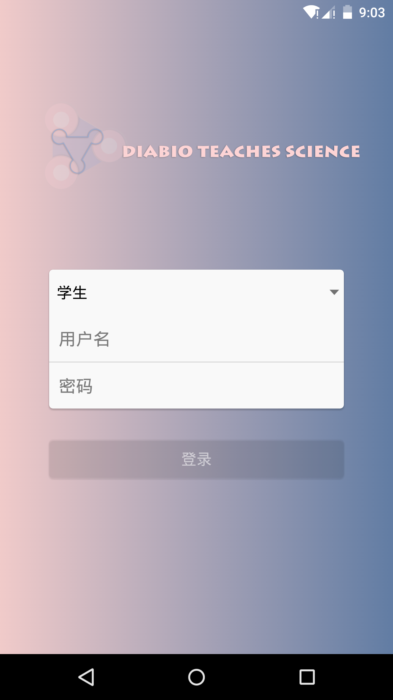 
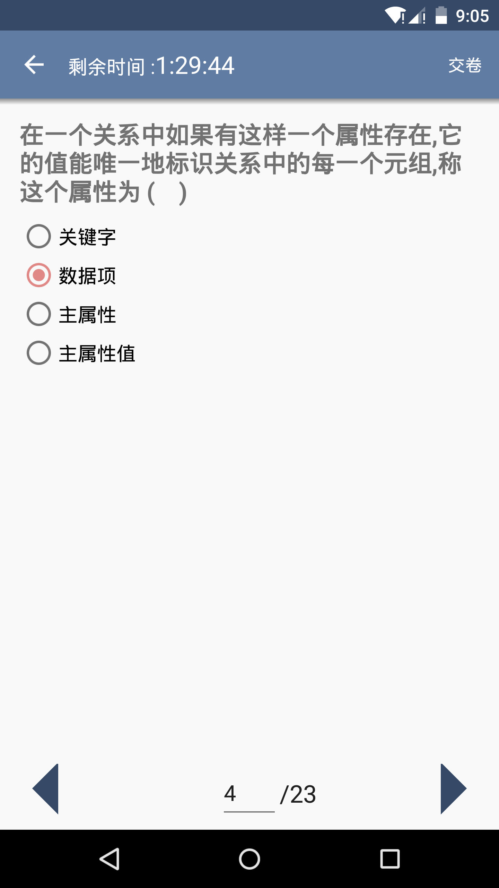 
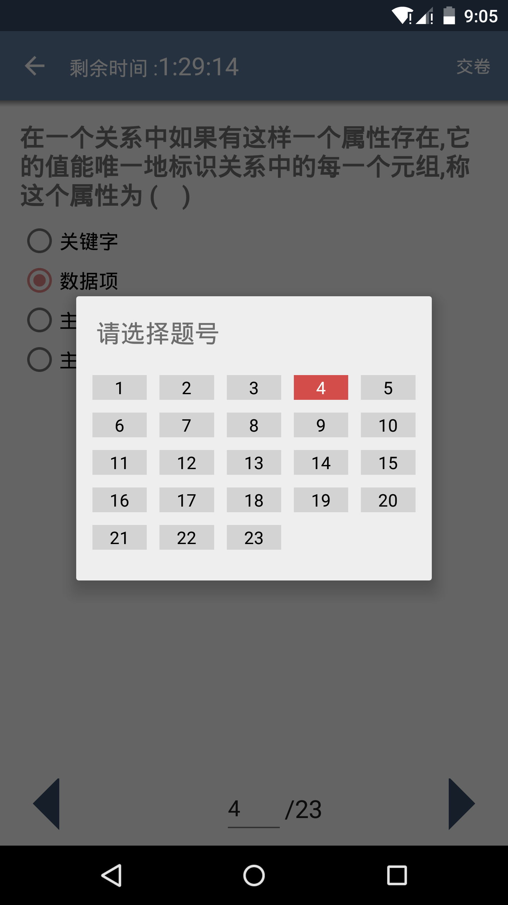 
 
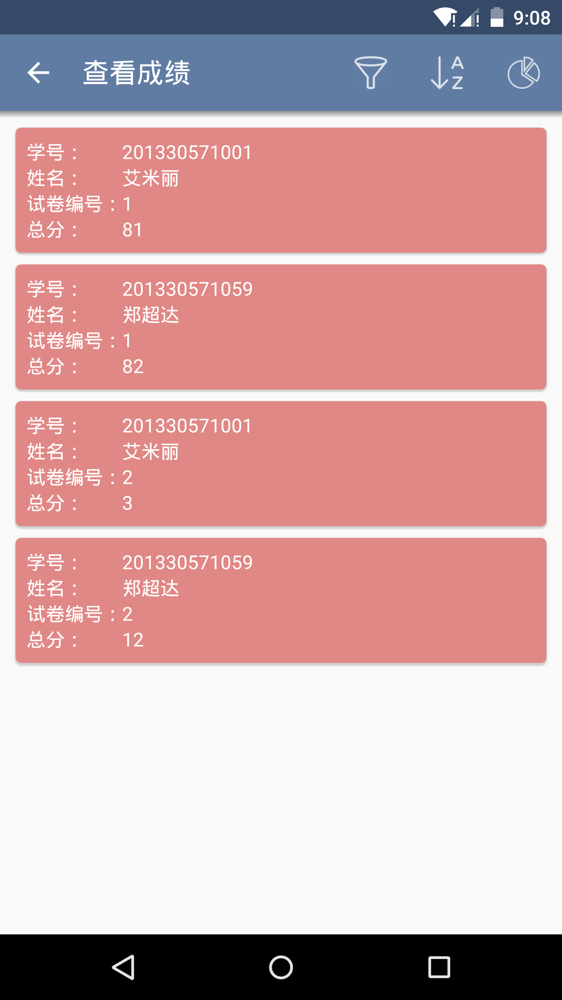 
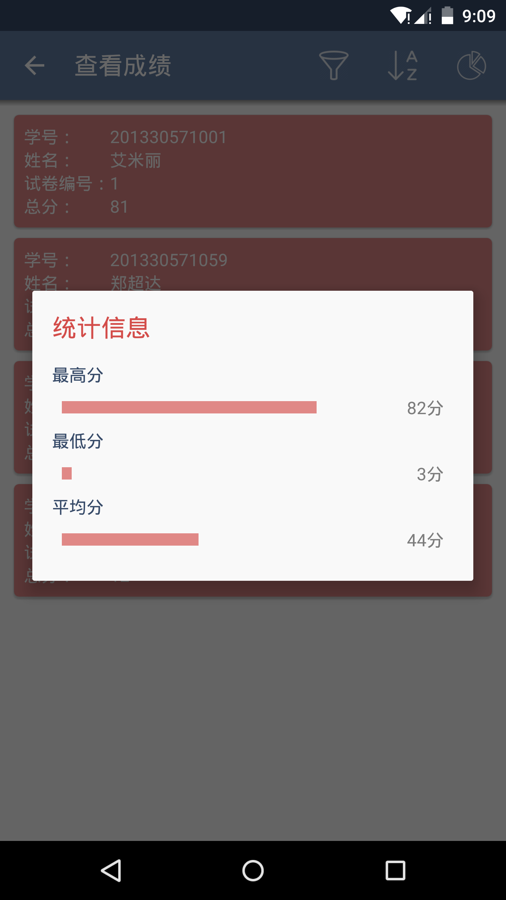 
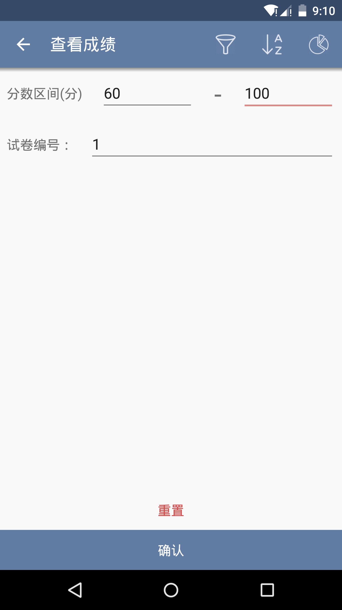 
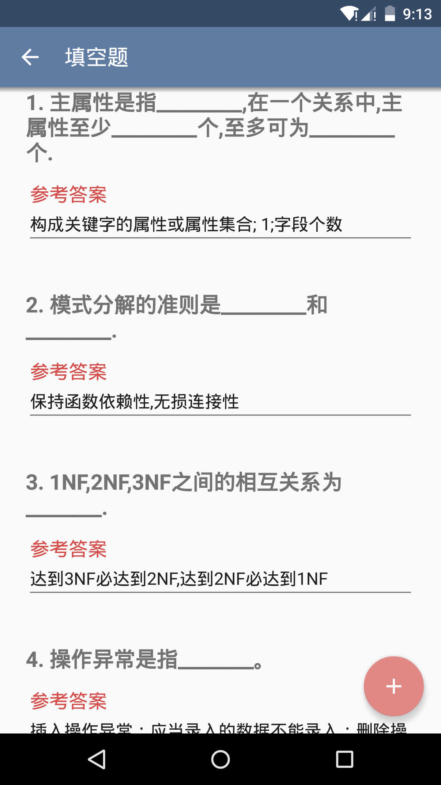 
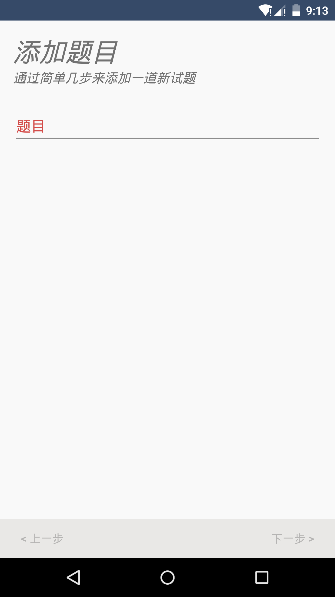 
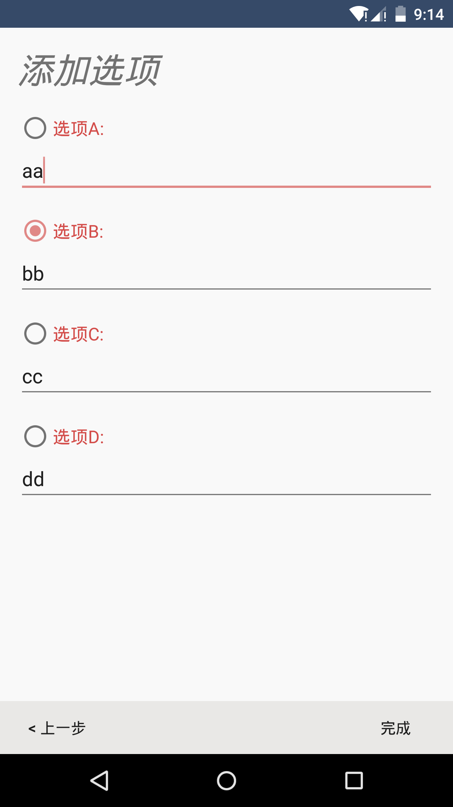 
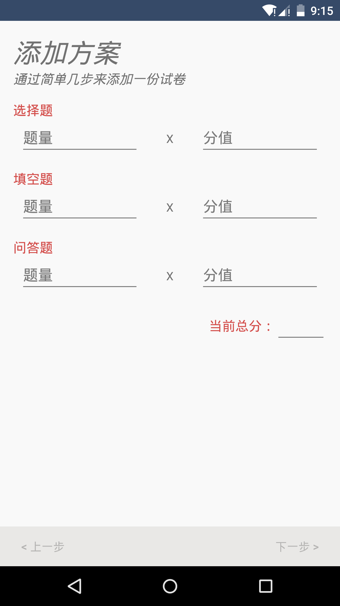 
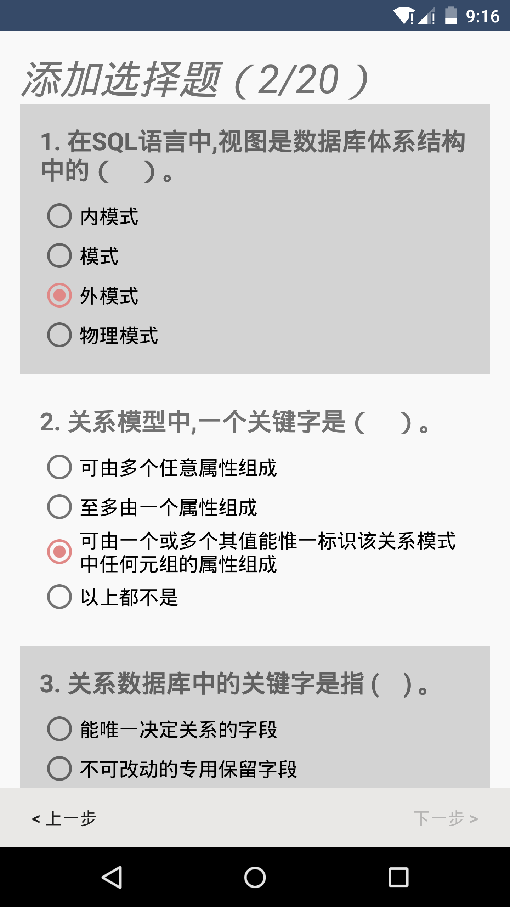 
 
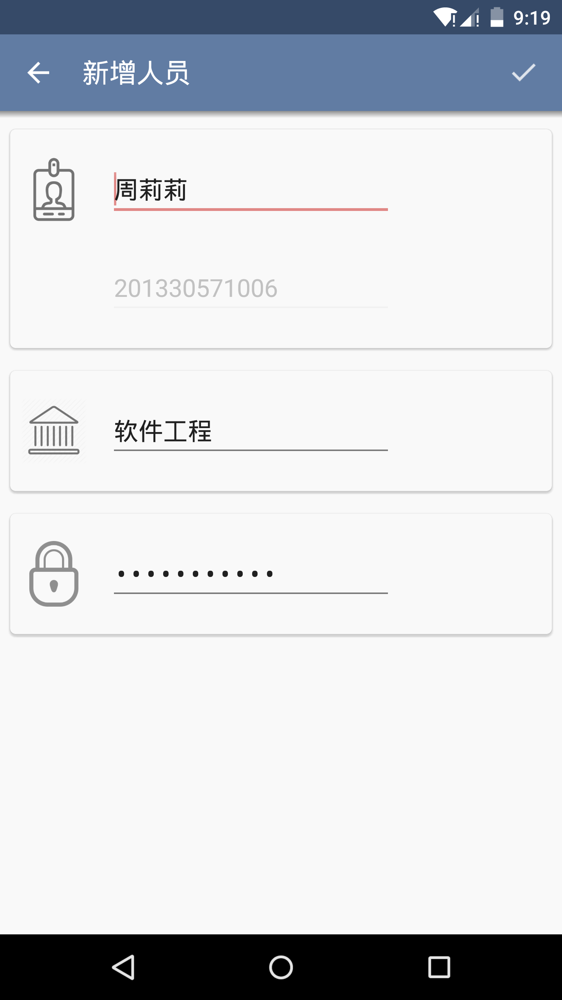 
